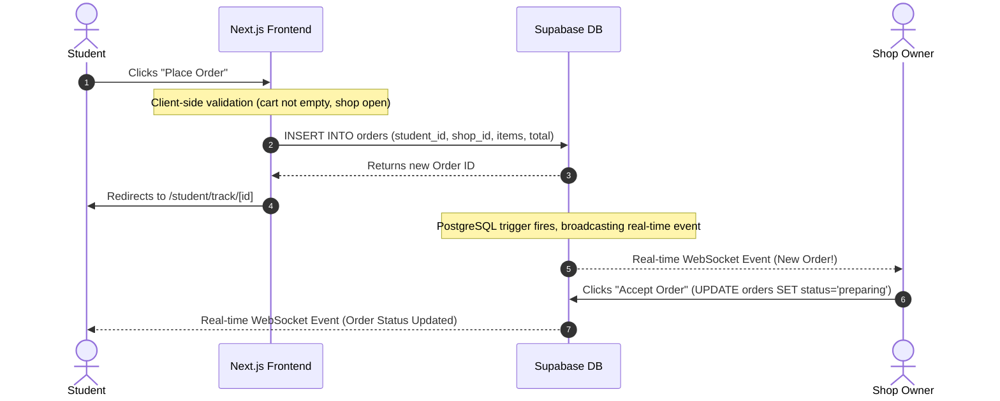
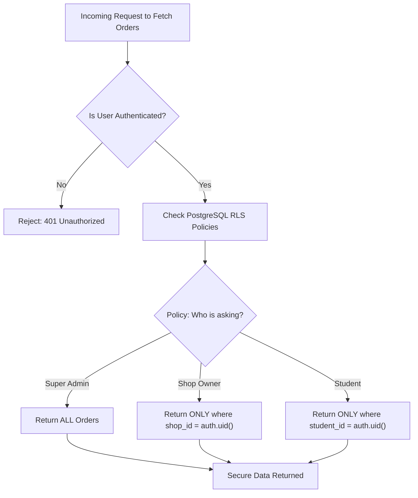

# DineNDeliver: Architecture Deep Dive for Interviews

To succeed in a technical interview, you don't need to memorize code. You need to be able to confidently explain the **architecture**, the **data flow**, and the **security model** of the system you built. 

This document breaks down the "Why" and the "How" of your platform so you can speak about it like a true Software Engineer.

---

## 1. The Core Architecture (The "Why")

When an interviewer asks: *"Walk me through the tech stack and why you chose it."*

**Your Answer:**
> "DineNDeliver is a multi-tenant B2B2C marketplace. Because SEO and initial page load speed are critical for the student-facing app, I chose **Next.js (App Router)** for its Server-Side Rendering (SSR) capabilities. For the backend, I needed a database that could securely handle real-time subscriptions and complex multi-role access control (Admin, Shop, Rider, Student) without building massive custom middleware. So, I chose **Supabase (PostgreSQL)** to leverage its native GoTrue Authentication and Row Level Security (RLS)."

---

## 2. The Data Flow (Placing an Order)

Interviewers love to ask: *"Explain what happens under the hood from the moment a user clicks 'Place Order' until the shop receives it."*

Here is the exact flow of data through your system:

**How to explain this in an interview:**
1. The frontend validates the cart and sends an asynchronous `INSERT` request to the Supabase PostgreSQL database.
2. The database receives the order. Because Supabase has real-time capabilities enabled on the `orders` table, it instantly fires a WebSocket event.
3. The Shop Owner's dashboard (which is listening to that specific WebSocket channel) receives the payload and updates the UI instantly without needing to manually refresh the page.

---

## 3. Security: Row Level Security (RLS)

If you say you built a multi-tenant app, the interviewer will ask: *"How do you prevent Shop A from accessing Shop B's orders?"*

If you built a custom Node/Express backend, you would have to write middleware for every single route (`if (req.user.shopId !== order.shopId) return 403`). This is prone to human error.

Instead, you used **Row Level Security (RLS)** directly inside the PostgreSQL database.

**How to explain this in an interview:**
> "I pushed authorization down to the database layer using PostgreSQL Row Level Security. Instead of trusting the API layer to filter data, I wrote SQL policies that automatically filter rows based on the user's JWT token. This means even if a Shop Owner somehow bypassed the frontend UI and made a direct API call to fetch all orders, the database itself would reject it and only return rows where the `shop_id` matches their authenticated token. It's mathematically secure at the lowest level."

---

## 4. Progressive Web App (PWA) & Caching

If you are asked about frontend performance or offline capabilities: *"How did you handle slow networks for students on campus?"*

You implemented a Service Worker (`sw.ts`) with custom caching strategies.

**Strategy 1: NetworkFirst (For the App Pages)**
For pages like `/student/home` or `/shop/dashboard`, the Service Worker tries to fetch the freshest data from the network first. If the network drops, it immediately falls back to the last cached version. This ensures users always see up-to-date menus when online, but the app doesn't crash if they enter a dead zone.

**Strategy 2: CacheFirst (For Images and Static Assets)**
For the brand logo, shop thumbnails, and fonts, the Service Worker checks the cache first. If it has the image, it serves it instantly (0ms load time) and doesn't even talk to the network. This saves massive amounts of bandwidth and makes the app feel incredibly snappy.

> [!IMPORTANT]  
> **The Bug We Fixed:** Remember the bug where the brand logo wouldn't update? In an interview, you can talk about this! You can say: *"I faced a tricky caching issue where my CacheFirst policy aggressively held onto an old logo filename. To fix it globally for all existing users without forcing them to clear their browser cache, I implemented a cache-busting strategy by renaming the asset and pushing an identical copy, instantly resolving the 404 errors."* That is a phenomenal interview story.
